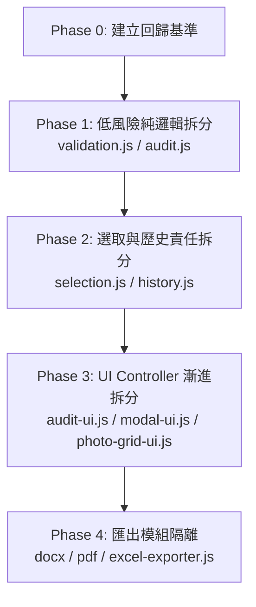

# Photo-Report-Generator 漸進模組化實作計畫 (Modularization Roadmap)

> **定位聲明**：本文件為 `Photo-Report-Generator` 專案之中期漸進模組化實作路線圖。本計畫僅作為架構演進指引，非強制一次實施之死規格；各階段必須依實際維護痛點與回歸風險獨立評估、獨立驗證、獨立交付。

---

## 一、核心目標與問題背景

### 1. 現狀痛點
目前 `index.html` 承載了超過 4,300 行程式碼，單一 `PhotoReportApp` 類別集中封裝了：
- DOM 快取與全域事件監聽（快捷鍵、滾輪縮放、窗格調整）
- 照片檔案處理與 Object URL 生命週期管理
- EXIF 方向解析與檔名時間解析
- 資料驗證（民國日期、時間格式）
- 完整度稽核（缺說明、缺地點、日期時間待確認、同名照片）
- 畫布排版、框選（Marquee）、卡片拖曳排序與鍵盤導航
- 多選狀態計算與資料同步
- 多步 Undo / Redo 快照與歷史管理
- 專案存檔與載入（`.prp` 格式）
- 匯出前提醒 Modal 與更新 Modal 控制
- 核心匯出模組（Word 3 大版型、PDF 3 大版型、Excel 清冊、ZIP 打包）

這導致：
1. **Agent 與開發者上下文成本過高**：微小調整需讀取大量不相關程式碼，消耗大量 Token。
2. **多 Agent 輪替理解成本高**：不同輪次的 Agent 需要重複理解大型單檔架構，難以迅速定位責任邊界。
3. **Review 範圍過大**：局部邏輯異動容易混入大檔案的排版或邊界，增加回歸風險。

### 2. 模組化核心原則與 KPI
- **依責任漸進拆分，而非一次全面重構**：模組化 KPI **不是「檔案越多越好」或「index.html 越短越好」**。
- **真正的目標**：未來修改特定功能（例如日期驗證、歷史邏輯、匯出版型）時，開發者與 Agent **只需讀取該專屬模組及其必要呼叫端，不必重讀 4,000+ 行單檔**。
- **可隨時停止**：各 Phase 獨立存在，若某 Phase 完成後已顯著降低痛點，專案可安全停在該 Phase，不強求拆完整個專案。

---

## 二、不可破壞之核心邊界（鐵律）

模組化過程必須嚴格遵循以下邊界，任何階段均不得違反：

1. **技術棧純粹性**：維持 Vanilla JS (ES Modules) + HTML5 + CSS，**嚴禁引入 React、Vue、Angular、Svelte 等前端框架**。
2. **零打包負擔**：不因模組化全面改寫 TypeScript 或引入 Vite、Webpack、Rollup 等建置打包工具。
3. **雙模式並行相容**：嚴格維持純 Web SPA（瀏覽器直接開啟）與 Tauri v2 桌面應用程式雙模式正常運作。
4. **100% 離線保證**：嚴格維持本機 `vendor/` 依賴，不新增任何外部網路 CDN 或執行階段網路請求。
5. **公務版型精準度不可妥協**：Word (`.docx`) 與 PDF 之 3 大公務標準版型（上下兩張、左右兩張、橫式三張）的表格尺寸、段落行高、頁邊距與縮放比例絕不可偏移或劣化。
6. **Undo / Redo 邊界安全**：
   - 快照與歷史僅記錄純資料狀態（`caseData`、`photos` 資料欄位、選取狀態、排序）。
   - **嚴禁將 UI 視圖狀態（`activeFilter`、縮放比例、捲軸位置、Modal 開關、彈窗分頁）納入歷史快照**。
7. **篩選與稽核唯讀性**：篩選列與完整度稽核純粹為資料讀取與視圖計算，**絕不修改 `photos` 原始資料**。
8. **搬移不改邏輯**：嚴禁在搬移模組的同時順便重構演算法或更動現有 UI/UX 行為；重構搬移與行為調整必須嚴格分輪。
9. **獨立驗證與獨立交付**：每個 Phase 必須獨立執行語法檢查、`prepare-web.ps1` 與 `qa.ps1`，獨立 Commit，禁止「大亂燉」式巨型 Commit。

---

## 三、Phase 0～4 漸進路線圖



---

### Phase 0｜建立回歸基準 (Regression Baseline)

- **目的**：在真正拆檔之前，建立目前正常版本的功能檢驗標準，作為後續各 Phase 驗證之對照組。
- **基準清單**：
  1. 照片載入（單檔、多檔、資料夾）與 Object URL 生成／釋放。
  2. 照片編輯（日期遮罩、時間遮罩、地點、說明、旋轉、流水號）。
  3. 完整度篩選列（全部、未填地點、未填說明、日期時間待確認、同名照片）與徽章數字。
  4. 多選操作（Shift 連選、Ctrl 點選、全選、拖曳框選 Marquee）。
  5. 排序操作（鍵盤精準位移、卡片指標拖曳插入、檔名自然排序）。
  6. Undo / Redo 資料恢復（驗證新增、修改、刪除、排序後復原重做之正確性）。
  7. 匯出流程與完整度提示彈窗：
     - Word 匯出（上下兩張、左右兩張、橫式三張）。
     - PDF 匯出（三大版型繪製）。
     - Excel 清冊匯出與匯入回填。
     - ZIP 原圖打包匯出。
  8. 雙模式驗證：純 Web 模式與 Tauri 桌面封裝模式。
- **原則**：不盲目引入重量級測試框架，優先利用現有 QA 腳本、輕量 Node 語法測試與明確驗收清單。
- **完成條件**：所有核心功能建立明確驗收手冊／指令紀錄。完成即停止，不自動進入 Phase 1。

---

### Phase 1｜低風險純邏輯拆分 (Pure Logic Extraction)

- **目的**：優先抽離無副作用、純資料計算、不依賴 DOM 與 App State 的獨立邏輯。
- **預定架構**：
  ```text
  js/
  ├─ validation.js
  └─ audit.js
  ```
- **職責劃分**：
  - `js/validation.js`：
    - `isValidMinguoDate(raw)`：民國年月日、大小月、閏年合法性判斷。
    - `isValidTimeFormat(raw)`：HH:MM、HH:MM:SS 合法範圍判斷。
    - 純粹 input → boolean，零 DOM 依賴。
  - `js/audit.js`：
    - `buildDuplicateNameSet(photos)`：同名照片集合計算。
    - `auditPhotosCompleteness(photos, defaultLocation)`：統計缺失項目與首要問題過濾器。
    - 純粹資料計算，不呼叫 `render()`，不修改傳入的 `photos`。
- **強制邊界**：
  - 不操作 DOM、不呼叫任何 UI 方法。
  - 不依賴 Modal、不負責匯出。
- **Phase 1 KPI**：未來調整日期規則或稽核邏輯時，僅需閱讀 `validation.js` 或 `audit.js`，完全不必載入 `index.html` 的龐大上下文。
- **完成條件**：
  - 單元測試與語法檢驗 100% 通過。
  - `scripts/prepare-web.ps1` 正常同步。
  - `scripts/qa.ps1` 通過。
  - 核心行為無任何改變。完成即停止。

---

### Phase 2｜選取與歷史責任拆分 (Selection & History Models)

- **前置條件**：Phase 1 穩定且已合併交付。
- **目的**：將複雜的多選索引計算與 Undo/Redo 歷史管理器獨立為專門模組。
- **預定架構**：
  ```text
  js/
  ├─ selection.js
  └─ history.js
  ```
- **職責劃分**：
  - `js/selection.js`：
    - 可見照片過濾計算（依 `activeFilter`）。
    - 鍵盤導航索引計算（上一張、下一張、跨欄移動）。
    - 多選邊界與批次位移計算。
    - 僅處理資料索引計算，指標與拖曳事件維持於 UI 層。
  - `js/history.js`：
    - `HistoryManager` 類別：管理快照推入、復原堆疊、重做堆疊與上限控制。
    - 快照產生與歷史特徵簽名比對（`historySignature`）。
    - 專案未儲存變更判定（`projectSignature`）。
- **強制邊界**：
  - 嚴格維持「UI 視圖狀態不進歷史」鐵律。
  - 若歷史與 App State 耦合過深，先記錄依賴清單，嚴禁強拆破壞資料穩定性。
- **完成條件**：
  - 完整驗證「修改資料 → Undo → Redo → 多選套用 → Undo → 切換篩選」歷史鏈正確無誤。
  - 獨立 Commit，完成即停止。

---

### Phase 3｜UI Controller 漸進拆分 (UI Presentation Components)

- **前置條件**：Phase 1、Phase 2 驗證有效降低耦合後方可評估。
- **目的**：避免產生單一巨大 `ui.js`，依呈現職責細分小型 UI 控制器。
- **預定架構**：
  ```text
  js/
  └─ ui/
     ├─ audit-ui.js
     ├─ modal-ui.js
     └─ photo-grid-ui.js
  ```
- **職責劃分**：
  - `audit-ui.js`：管理完整度篩選列按鈕樣式、即時徽章更新與篩選提示文字。
  - `modal-ui.js`：通用 Modal 開啟、關閉、ESC 監聽與標題／內文動態注入。
  - `photo-grid-ui.js`：縮圖卡片 DOM 渲染、選取外框呈現與拖曳視覺提示。
- **原則**：UI 模組僅負責 DOM 呈現與事件轉發，實質商業邏輯與資料過濾一律向下呼叫邏輯層模組。
- **完成條件**：純 Web 與 Tauri 桌面端視覺操作無任何破圖或事件失靈。

---

### Phase 4｜匯出模組隔離 (Exporter Isolation)

- **前置條件**：前面各 Phase 均已穩定，且 Exporter 程式碼確實造成維護阻礙。
- **風險等級**：**最高風險（公務清冊法律採證標準），務必最後處理**。
- **預定架構**：
  ```text
  js/
  └─ exporters/
     ├─ docx-exporter.js
     ├─ pdf-exporter.js
     └─ excel-exporter.js
  ```
- **核心策略**：
  - **僅做「程式搬移＋建立乾淨 Context 輸入介面」**，嚴禁在搬移時順便優化版型或演算法。
  - 保持主 App 呼叫介面不變，逐步轉為薄封裝（Thin Wrapper）：
    ```javascript
    async exportDocx() {
        return exportDocxReport(this.getExportContext());
    }
    ```
- **完成條件**：
  - 實際產出 Word、PDF 與 Excel 檔案。
  - 比對版型表格尺寸、邊距、字型（標楷體）與縮放比例，確認與原版本 100% 吻合。

---

## 四、關於 `app.js` 的定位說明

- **絕不第一步搬移 App 本體**：如果直接將 4,300 行的 `PhotoReportApp` 整塊搬至 `app.js`，本質上只是「大單檔由 HTML 換到 JS」，**完全沒有降低耦合與 Token 讀取成本**。
- **後期定位**：唯有當前述 Validation、Audit、Selection、History 及 Exporter 各模組均已獨立抽出，`PhotoReportApp` 縮減為僅剩初始化、狀態持有與高階事件入口（約 300～500 行）時，才評估將本體移入 `js/app.js`。

---

## 五、Git、驗證與停止治理

1. **單一 Phase 單一任務**：不得跨 Phase 混合實作，嚴禁巨型重構 Commit。
2. **Commit 規範**：
   - Phase 1: `refactor(audit): 抽離日期驗證與完整度稽核純邏輯至獨立模組`
   - Phase 2: `refactor(history): 獨立選取計算與歷史快照管理器`
3. **終止與暫緩權限**：在任何 Phase 啟動前，若評估現況已穩定運作且無實質維護障礙，**優先判定暫緩或停止**，嚴禁為追求「架構完美」進行無效益重構。
